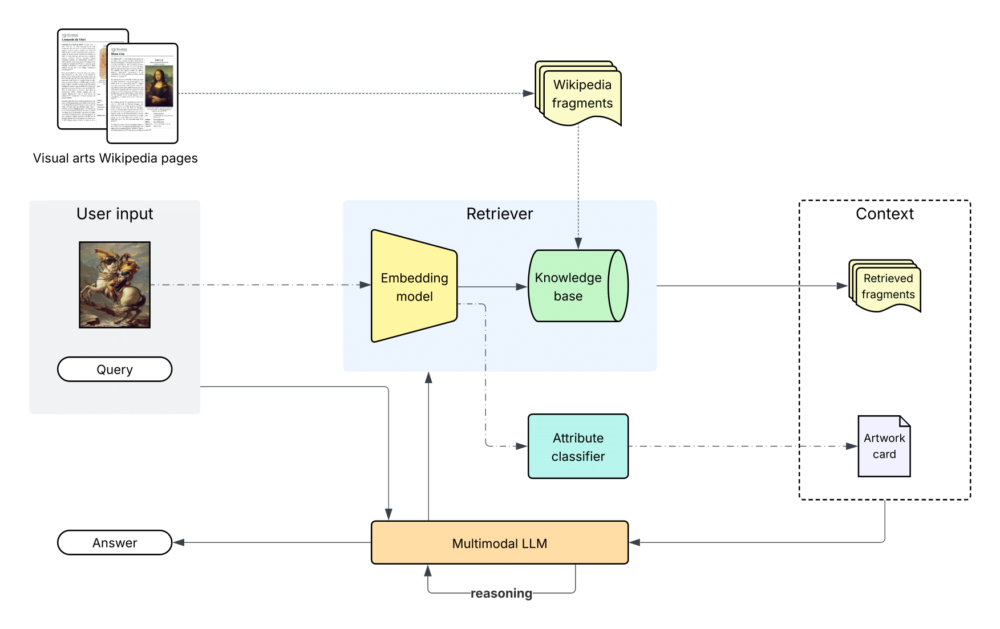
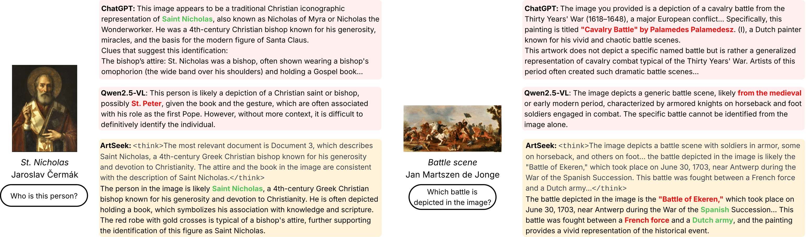
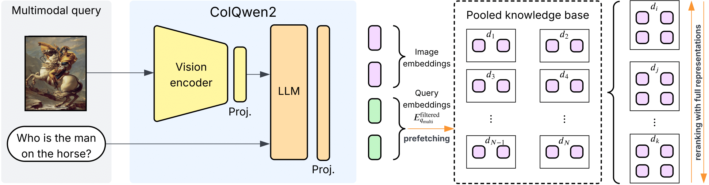
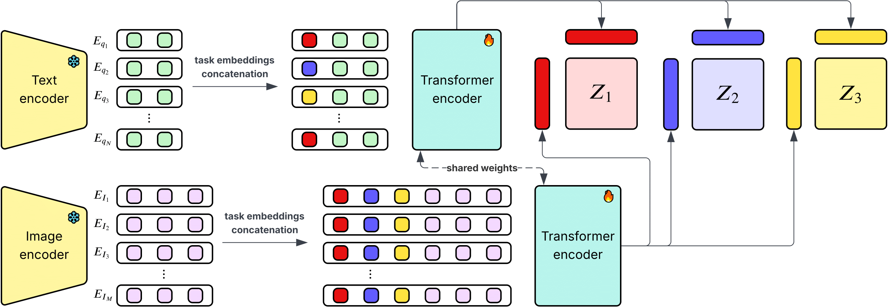
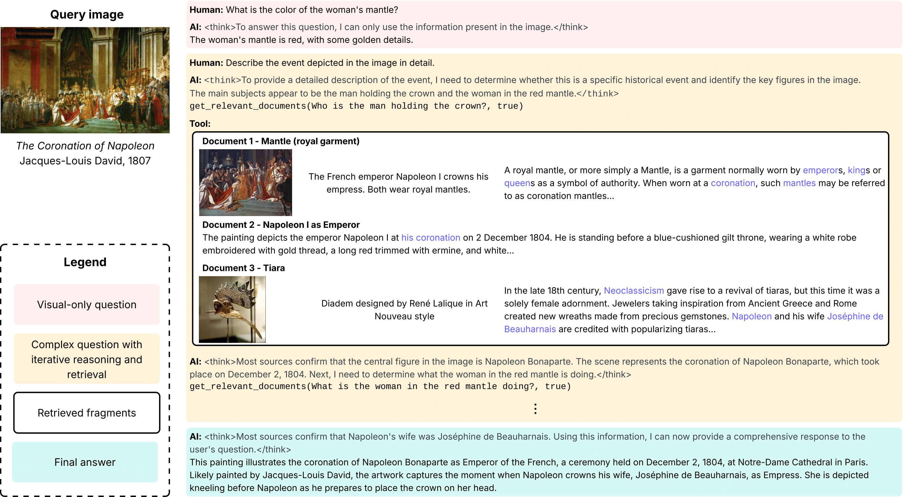

# ArtSeek

This repository contains the official code for the paper ["ArtSeek: Deep artwork understanding via multimodal in-context reasoning and late interaction retrieval"](https://www.arxiv.org/abs/2507.21917).





## Summary

ArtSeek is a multimodal system for understanding artworks, which combines three main components:

1. **Multimodal retrieval through late interaction**: ArtSeek retrieves relevant information from a large corpus containing more than 5 million multimodal fragments of information from the Wikipedia section on visual arts, using a late interaction retrieval mechanism which we have developed starting from the ColQwen2 model.



2. **Multitask attribute prediction through Late Interaction Classification Network (LICN)**: ArtSeek predicts attributes of artworks, such as the artist, genre, and style, using a Late Interaction Classification Network (LICN) that combines the multimodal retrieval with a classification head, and an approach to predict multiple embeddings for each classification task.




3. **In-context reasoning through a multimodal large language model**: ArtSeek uses a multimodal large language model (MLLM) to perform reasoning on the retrieved information and the predicted attributes, allowing it to answer questions about artworks and provide explanations. The reasoning process allows the model to decide the queries to send to the retrieval system, and to select the most relevant information from the retrieved fragments. This ability of the Qwen2.5-VL-32B model is activated through in-context learning, where the model is prompted with examples of reasoning tasks and their solutions.



## Installation

Create a conda environment using the provided `artseek.yml` file:

```bash
conda env create -f artseek.yml
```

Then install PyTorch and the other dependencies. For example, for CUDA 12.4, run:

```bash
conda activate artseek
pip3 install torch torchvision torchaudio
conda install -c conda-forge transformers
pip3 install accelerate
pip3 install bitsandbytes
pip3 install flash-attn --no-build-isolation
pip3 install autoawq
```

## Data Collection and Preprocessing

All functions used for data collection and preprocessing should be called in the order they appear in the module `artseek.data.main`, using the corresponding commands. Currently, the operations are the following:

1. `download-wikiart-images`: Downloads images from WikiArt for the artworks in the ArtGraph knowledge graph. Repeat this operation until the image folder contains 116475 images. We use these images to train the LICN module.

2. `make-artgraph-dataset`: Creates the ArtGraph dataset for multitask classification starting from the Neo4j database of the ArtGraph knowledge graph. To make this operation work, you need to have Neo4j database running with the ArtGraph knowledge graph loaded. Please, [follow the instructions](https://zenodo.org/records/8172374) to downlod and setup the knowledge graph. The dataset is saved in the `data/artgraph` directory.

3. `define-valid-labels-artgraph-dataset`: Defines the valid labels for the ArtGraph dataset for evaluation purposes. All labels are considered in the full pipeline.

4. `get-visual-arts-dataset-pages`: this operations searches for the category "Visual arts" in Wikipedia and recursively adds all the pages that are linked to it or to one of its subcategories, up to a specified depth (default is 5). We then register the page ID and title in a CSV file.

5. `python WikiExtractorNew.py --json -s --lists --links ../data/dumps/enwiki-latest-pages-articles.xml.bz2 -o text_en` (not in the main module): this command extracts the text from the Wikipedia dump. The output is a directory with a file for each page, containing the text of the page in JSON format. We edited the original WikiExtractor to include image files (PNGs and JPEGs) from thumbnails and infoboxes in the Wikipedia pages, and kept their URLs and captions, while expressing them as `<a>` tags in the text. The output is saved in the `text_en` directory. The command should be run in the `wikiextractor` directory. Differently from Cohere, we also keep text links in the text, as they can be useful in the future.

6. `download-and-save-images-wikipedia`: downloads images from the Wikipedia pages in the `text_en` directory. The images are saved in the `data/wikipedia_images` directory.

7. `create-wikifragments-dataset`: creates a HF dataset whose lines are the Wikipedia paragraphs, with images attached to them. Specifically, a paragraph is connected to a list of images (possibly empty), if it is the nearest after the image tag in the text.

8. `create-wikifragments-visual-arts-full-dataset`: selects the visual arts pages from the HF dataset and builds the fragment images using the images and paragraph inside the example.

9. `make-qdrant-store`: creates a Qdrant store for the fragments in the HF dataset. Ensure that the Qdrant server is running before executing this command.

10. `add-qdrant-index`: adds the HNSW index to the Qdrant store for the fragments in the HF dataset. This is used for efficient retrieval of fragments.

## Try ArtSeek!

> [!NOTE]  
> ArtSeek was developed and tested on a machine with 8 CPU cores, 128 GB of RAM, and an NVIDIA A100 GPU with 64 GB of VRAM. To run the full pipeline you need to launch the Qdrant server with the `wikifragments_visual_arts_dataset_embeds` collection. The Qdrant store might require around 1.5 TB of disk space, so ensure you have enough space available.

To try ArtSeek, download the pre-trained models from Hugging Face:

* [`vidore/colqwen2-v1.0`](https://huggingface.co/vidore/colqwen2-v1.0): the ColQwen2 model used for multimodal retrieval and late interaction classification. We put the model repo in the `models` directory.
* [`Qwen/Qwen2.5-VL-32B-Instruct-AWQ`](https://huggingface.co/Qwen/Qwen2.5-VL-32B-Instruct-AWQ): the Qwen2.5-VL-32B model used for in-context reasoning.
* LICN module: the weights of the LICN module will be made available soon.

Then you can simply run the `try.ipynb` notebook to get started with ArtSeek. You can also turn on/off the classification and retrieval modules by setting the `classify` and `retrieve` parameters in the `build_graph` function.

## Train the LICN Module

```bash
accelerate launch -m artseek.method.classify.train_li_classification_network train --config-path models/configs/classify/li_classification_network_tft.yaml
```

## Evaluation

Evaluation is performed on the three tasks separately.

1. **Multimodal retrieval**: The retrieval task is evaluated using the `artseek/method/retrieve/eval.py` script. You have to create the separate data stores for evaluating the different possible configurations.

2. **Classification**: `accelerate launch -m artseek.method.classify.train_li_classification_network test --config-path models/configs/classify/li_classification_network_tft.yaml`.

3. **Text generation**: perform inference with `python -m artseek.method.generate.test inference --config-path models/configs/generate/artpedia_short.yaml` which will generate the texts and save the messages produced by the model in the corresponding `models/checkpoints` directory. Then launch `python -m artseek.method.generate.eval pred-message-to-str --config-path models/configs/generate/artpedia_short.yaml` to compute NLP metrics on the generated texts. Consider turning off SPICE for large datasets such as PaintingForm. You have to setup the datasets ArtPedia, PaintingForm, and SemArt v2.0 as explained in the README of the `data` directory.